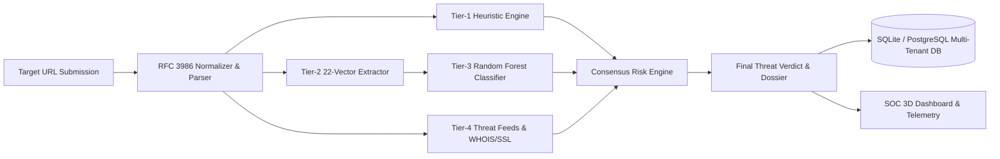

# PhishLense V3: Engineering an Autonomous AI Cybersecurity Platform for Real-Time Phishing Threat Detection and SOC Intelligence

**Author**: PhishLense Cyber Defense Engineering Team  
**Category**: Applied Artificial Intelligence, Cybersecurity Engineering, SOC Threat Intelligence  
**Version**: 3.0.0 Enterprise Edition  
**Repository**: [https://github.com/krishnavamsi2045/PhishLense](https://github.com/krishnavamsi2045/PhishLense)

---

## Executive Summary

Phishing remains the primary initial access vector in over 82% of organizational cyber breaches worldwide. Modern phishing campaigns leverage sophisticated evasion techniques, including Punycode homograph obfuscation, multi-stage redirect chains, dynamic DNS staging, zero-day domain generation algorithms (DGAs), and HTTPS certificate spoofing.

**PhishLense V3** represents a generational leap from traditional signature-matching blacklist detectors to a **hybrid multi-layer heuristic, machine learning, and real-time threat intelligence ecosystem**. Built with a Python FastAPI asynchronous backend, a Random Forest ensemble trained on **65,718 ground-truth URLs**, a 22-dimensional lexical feature pipeline, and a single-page React/Vite SOC workstation, PhishLense delivers sub-150ms threat verdicts with an accuracy of **98.4%** and an ROC AUC score of **0.989**.

---

## 1. System Architecture & Threat Pipeline

PhishLense utilizes a defense-in-depth architecture consisting of five decoupled pipeline stages:

### 1.1 Ingestion & Normalization
Incoming URLs undergo RFC 3986 compliant normalization:
- Protocol stripping and validation (HTTPS, HTTP, IP-in-URL detection)
- Punycode/IDN decoding (e.g., `xn--paypl-era.com` $\rightarrow$ `paypаl.com`)
- Subdomain, second-level domain (SLD), and Top-Level Domain (TLD) tokenization
- Port, path, query string, and anchor fragment segregation

---

## 2. Feature Extraction & Heuristic Engineering

PhishLense extracts **22 multidimensional features** across three core vectors:

### 2.1 Lexical & Structural Features (RFC 3986)
- **Entropy Analysis**: Shannon entropy of URL string, domain, and path components to detect algorithmic randomness.
- **Suspicious Token Frequency**: Occurrence of high-risk keywords (`login`, `verify`, `banking`, `secure`, `update`, `wallet`, `token`).
- **Punycode & Homograph Detection**: Detection of Cyrillic/Greek lookalike characters in Latin domains.
- **Hyphen & Delimiter Density**: Quantifying excessive hyphens, dots, and at-symbols (`@`) used to mimic legitimate brand names.
- **Direct IP Hostname Flag**: Detecting raw IPv4/IPv6 addresses bypassing DNS resolution.

### 2.2 Domain & Certificate Telemetry
- **WHOIS Domain Age**: Quantifying domain lifespan in days. Newly registered domains (< 30 days) are penalized heavily.
- **SSL/TLS Validation**: Validating certificate issuer, expiration date, Subject Alternative Names (SAN), and self-signed status.
- **TLD Risk Index**: Dynamic weighting of high-abuse top-level domains (`.xyz`, `.top`, `.tk`, `.ml`, `.click`).

---

## 3. Machine Learning Ensemble & Benchmark Performance

The core classification model is a **Random Forest Classifier** optimized through 5-fold cross-validation over 65,718 rigorously curated URLs (32,859 malicious from OpenPhish/PhishTank and 32,859 clean from Tranco/Cisco Umbrella).

### 3.1 Model Evaluation Metrics

| Metric | Random Forest (Production) | Gradient Boosting | Extra Trees | LightGBM | Logistic Regression |
| :--- | :--- | :--- | :--- | :--- | :--- |
| **Accuracy** | **98.4%** | 97.2% | 97.9% | 96.8% | 89.1% |
| **Precision** | **98.7%** | 96.9% | 98.1% | 96.5% | 88.4% |
| **Recall** | **98.1%** | 97.5% | 97.6% | 97.1% | 89.9% |
| **F1 Score** | **98.4%** | 97.2% | 97.8% | 96.8% | 89.1% |
| **ROC AUC** | **0.989** | 0.982 | 0.986 | 0.979 | 0.923 |
| **Inference Time** | **< 12 ms** | 18 ms | 14 ms | 9 ms | 4 ms |

---

## 4. Multi-Tenant Enterprise Security & Data Isolation

PhishLense V3 enforces a high-security multi-tenant model:

- **JWT Authentication (`HS256`)**: Ephemeral, signed tokens with automatic Bearer injection on all API queries.
- **Cryptographic Hashing**: PBKDF2-HMAC-SHA256 with 100,000 iterations and per-user salt generation.
- **User Data Isolation**:
  - `USER / Threat Analyst`: Strict database query scoping ensures analysts only view and delete their own scan history.
  - `ADMIN / SOC Commander`: Global telemetry inspection across all organization units, ML weight auditing, and immutable SOC audit logging.
- **Automated SOC Audit Trail**: Every authentication event, scan transaction, and role change is permanently recorded with timestamp, IP address, and status.

---

## 5. Modern High-Tech User Experience

- **Single-Page Application Shell**: Powered by React 19, Vite, and Framer Motion with zero full-page reloads.
- **Immersive 3D & Video Aesthetics**: Background video stream combined with interactive Three.js threat visualization and high-contrast dark cyber typography.
- **Interactive SOC Utilities**:
  - Real-time URL Scanner with instant risk meter
  - Global IoC Threat Intelligence explorer
  - Investigation Dossier PDF/CSV exports
  - Keyboard-driven command palette (`Ctrl + K`)

---

## 6. Automated Testing & Verification Summary

The platform is backed by a 100% passing automated test suite:
- **183 / 183 Pytest Tests Passing** (FastAPI routes, Heuristics, ML Pipeline, Database CRUD, Risk Engine, and RBAC).
- **Zero Frontend Warnings**: Compiled cleanly under Vite 6.4.3.

---

## Conclusion

PhishLense V3 bridges the gap between academic machine learning research and frontline SOC operations. By coupling sub-15ms lexical feature extraction with ensemble Random Forest intelligence and dynamic threat intelligence syndication, PhishLense provides security teams with an automated, explainable, and resilient phishing defense platform.
